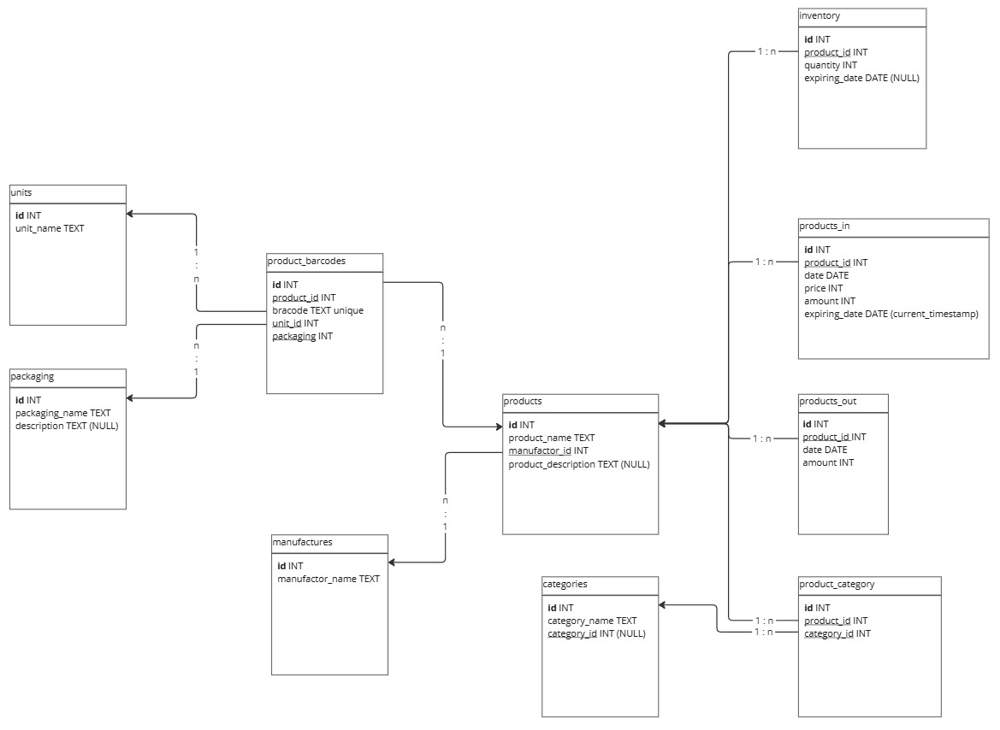

# **Product Inventory Management System**

A robust system for managing product inventory with barcode/QR scanning, database integration, and reporting features.

---

## **📖 Table of Contents**
- [Overview](#overview)
- [Features](#features)
- [Technologies Used](#technologies-used)
- [Installation](#installation)
- [Database Structure](#database-structure)
- [Contributing](#contributing)
- [License](./LICENSE)

---

## **🔍Overview**
This project is a complete inventory management system designed to:
- Scan barcodes or QR codes of products.
- Track product stock levels automatically.
- Handle product entry with details such as category, price, and expiry date.
- Generate weekly, monthly, quarterly, and yearly reports for:
    - Incoming products.
    - Outgoing products.
    - Money spent on inventory.
- Support configurable packaging units (e.g., bottles, packets, bags).

---

## **✨Features**
- **Database Management:** CRUD operations for products, categories, and packaging units.
- **Stock Tracking:** Automatic stock adjustments when scanning products.
- **Reports:** Detailed visual reports on inventory movement and expenditures.
- **Packaging Units:** Define and manage packaging types (e.g., bottles, packets).

---

## **🛠️Technologies Used**
- **Programming Languages:**
    - C++
    - Python (Data processing and report generation).
- **Database:** SQLite (lightweight and embedded database).
- **Frontend/Visualization:** Matplotlib and Pandas for generating charts and graphs.

---

## **Database Structure**

The database schema consists of the following tables:
1. **Products:** Contains product details such as name, category, price, and expiry date.
2. **Categories:** Contains product categories and subcategories.
3. **Units:** Contains packaging types (e.g., bottles, packets).
4. **Inventory:** Contains product stock levels and expiring dates.
5. **Manufacturers:** Contains manufacturer details.
6. **Packaging:** Contains packaging details such as weight, dimensions, and material.
7. **Product in**: Contains incoming product details.
8. **Product out**: Contains outgoing product details.
9. **Product Barcode**: Contains product barcode details.
10. **Product Category**: Contains product category details.

The following Entity Relation Diagram *(ERD)* illustrates the relationships between the tables:
 

---

## **⚙️Installation**
### **Prerequisites**
1. Install Python 3.9+ and the following Python libraries:
   ```bash
   pip install pandas matplotlib sqlite3
